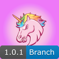

# iOS-Pipeline-Demo
Ein Projekt zur Demonstration von erweiterter Pipeline Integration von Github Actions in ein iOS Projekt.

# Xcode Project Setup

Das Xcode Projekt ist so schmal wie möglich aufgesetzt. Es besteht aus:

- 1 App Target
- 1 Unit Test Target
- 1 Scheme
- 2 Configurations (Debug, Release)

Dabei werden Konfigurationsparameter über Umgebungsvariablen und Build Settings injected. Das beginnt bei Version und Bundle Id und erstreckt sich bis hin zu den Signing Einstellungen. Build Settings, die nicht im Editor erreichbar waren, wurden händisch in der Textdatei angepasst.

```pbxproj
MARKETING_VERSION = "$(DEMO_VERSION)";
PRODUCT_BUNDLE_IDENTIFIER = "$(DEMO_BUNDLE_ID)";
PRODUCT_NAME = "$(TARGET_NAME)";
PROVISIONING_PROFILE_SPECIFIER = "$(DEMO_PROVISIONING_PROFILE_NAME)";
"PROVISIONING_PROFILE_SPECIFIER[sdk=iphoneos*]" = "$(DEMO_PROVISIONING_PROFILE_NAME)";
```

## Debug

Die Debug Konfiguration wird nur lokal auf dem Entwicklerrechner oder für Unit Tests gebaut. Für sie existiert eine [Debug.xcconfig](./GithubActionDemo/Resources/Debug.xcconfig), in der notwendige Umgebungsvariablen gesetzt werden.

```xcconfig
DEMO_VERSION=0.1.0
DEMO_BUILD_NUMBER=0
DEMO_BUNDLE_ID=de.adesso-mobile.research.ghademo.debug
DEMO_BACKEND_ENVIRONMENT=dev
DEMO_APP_ICON=AppIconDebug
```

Um nicht mit Signing Assets und Geräteregistrierung kämpfen zu müssen, ist der Code Signing Style von Debug auf *Automatisch* gestellt.

## Release

Release kann auf dem Entwicklerrechner nicht direkt gebaut werden. Das liegt daran, dass erforderliche Umgebungsvariablen nicht gesetzt sind. So fehlt bspw. der Release Konfiguration ein Bundle Identifier. Diese Einschränkung auf der einen Seite ermöglicht es uns aber, in der CI aus einer Release Konfiguration unterschiedliche Artefakte zu bauen:

<center>
<table>
<tr>
<td><center></center></td>
<td><center></td>
<td><center></center></td>
<td><center></center></td>
</tr>
<td>App Icon Branch</td>
<td>App Icon Snapshot</td>
<td>App Icon Release</td>
<td>App Icon App Store</td>
</table>
</center>

# Artefakte

Die Artefakte sind nicht, wie klassisch, nach Backend-Umgebungen ausgestaltet. Es existieren also keine Dev, Staging, UAT, Preprod, Prod (usw.) Builds. Stattdessen erfolgt die Auswahl der Backend-Umgebung innerhalb der App, zur Laufzeit, oder wird durch die CI als Umgebungsvariable gesetzt.

<center></center>

Stattdessen sind Artefakte nach ihrem Software-Reifegrad strukturiert, ähnlich wie ein Backend es aus seiner Perspektive auch macht. Beispielsweise ist Dev ein ungetesteter Softwarestand aus der Entwicklung, Staging ist getestet und kann potenziell live gehen, Prod ist in Produktion.

Stellen wir uns App-seitig analog auf, ergeben sich beispielhaft folgende Artefakte:

<table>
<tr>
<th>Artefakt</th>
<th>Reifegrad</th>
<th>Zeitpunkt des Builds</th>
<th>Anwendungsfall</th>
<th>Backend</th>
</tr>
<tr>
<td>Branch</td>
<td>Ungetestete Entwicklung</td>
<td>Wenn ein Pull Request zu develop geöffnet oder aktualisiert wird.</td>
<td>Mit einem Branch Artefakt (auch Feature oder Bugfix Build genannt) können Feature und Bugfix branches getestet werden, bevor sie auf develop gemerged werden.</td>
<td>Environment Selector</td>
</tr>
<tr>
<td>Snapshot</td>
<td>Feature Test erfolgreich. Einzelne Features können noch unvollständig sein.</td>
<td>Wenn ein Pull Request zu develop gemerged wurde.</td>
<td>Ein Snapshot Artefakt wird nach jedem Merge zu develop erstellt. Er dient als Dokumentation des Entwicklungsfortschritts. Er kann auch als Referenz bei Feature Tests herangezogen werden oder als Analysewerkzeug, um einzugrenzen, durch welchen Merge ein Bug verursacht wurde.</td>
<td>Environment Selector</td>
</tr>
<tr>
<td>Release Candidate</td>
<td>Features vollständig, Regressionstest läuft</td>
<td>Wenn ein Pull Request zu main/master geöffnet oder aktualisiert wird.</td>
<td>Mit einem Release Candidate Artefakt (auch Feature oder Bugfix Build genannt) können Feature und Bugfix branches getestet werden, bevor sie auf develop gemerged werden.</td>
<td>Staging oder äquivalent</td>
</tr>
<tr>
<td>App Store</td>
<td>Features sind vollständig und funktionieren</td>
<td>Wenn ein Pull Request zu main/master gemerged wurde.</td>
<td>Das App Store Artefakt ist die App, die zu Testflight hochgeladen und im Store released wird.</td>
<td>Produktion</td>
</tr>
</table>

Ein Git-Flow Diagramm, dass diesen Artefakten Rechnung trägt, sähe vereinfacht wie folgt aus:


Selbstverständlich ist es möglich, hier noch release Branches einzubauen, deren Erstellung oder Aktualisierung einen Release Candidate Build auslösen. Die genaue Ausgestaltung des Git Flow ist von verschiedenen Kriterien abhängig, wie bspw. ob mehrere Teams gleichzeitig am Repo arbeiten, ob während des Regressionstests am Produkt weiterentwickelt werden soll, dem Grad der Testautomatisierung.

# Umsetzung in der Pipeline

Das oben beschrieben Git Flow Diagramm wurde im vorliegenden Repository mit Github Action umgesetzt. Zu jedem der Artefakte existiert ein Github Action Workflow (TeamCity Wording: Build-Konfiguration), der das Artefakt produziert und Qualitätsmerkmale prüft.

|Artefakt|Workflow|
|-|-|
|Branch|[feature-bugfix.yml](./.github/workflows/feature-bugfix.yml)|
|Snapshot|[snapshot.yml](./.github/workflows/snapshot.yml)|
|Release Candidate|[release-candidate.yml](./.github/workflows/release-candidate.yml)|
|App Store|[app-store.yml](./.github/workflows/app-store.yml)|

Diese Artefakt-Workflows setzen sich aus anderen Workflows zusammen, die parametrisiert von den Artefakt-Workflows aufgerufen werden. Die Artefakt-Workflows bestimmen also nur, (1) welche Schritte Teil dieses Build Jobs sind (Lint, Unit Test, Build, Deploy) und (2) mit welchen Parametern diese Schritte aufgerufen werden.

Die aufgerufenen Workflows werden auch als [Reusable Workflows](https://docs.github.com/en/actions/using-workflows/reusing-workflows) bezeichnet.

Dabei abstrahieren die wiederverwendeten Workflows größere Teile der Pipeline in isolierte Blöcke. Zum Beispiel existiert der [build-archive.yml](./.github/workflows/build-archive.yml), welcher die Provisioning Profiles installiert, eine Keychain hinzufügt und entsperrt, das xcarchive baut, das IPA exportiert und anschließend als Artefakt hochlädt.

Ein simplerer Workflow ist der [deploy-to-appcenter.yml](./.github/workflows/deploy-to-appcenter.yml):

```yml
# Anzeigename des Workflows
name: "Deploy To AppCenter"
# Wann wird dieser Workflow ausgeführt?
on: 
  # Dieser Workflow wird nur ausgeführt, wenn er von anderen Workflows aufgerufen wird.
  workflow_call:
    # Welche Parameter benötigt er?
    inputs:
      # Die Buildvariante. Z.B. Branch.
      build-variant:
        required: true
        type: string
      # Die AppCenter Distribution Groups. CSV.
      distribution-groups:
        required: true
        type: string
      # AppCenter App Name
      appcenter-app-name:
        required: true
        type: string

# Umgebungsvariablen für diesen Workflow
env:
  BUILD_OUTPUT_DIRECTORY: .build

# Jobs, aus denen der Workflow besteht
jobs:
  # Deploy to appcenter job     
  deploy-to-appcenter:
    name: Deploy To AppCenter
    # Wird auf Ubuntu ausgeführt, im Container.
    runs-on: ubuntu-latest
    steps:
      # 1. Schritt: Artefakte herunterladen. Hier ist u.A. das ipa enthalten.
      - name: Download artficats
        uses: actions/download-artifact@v3
        with:
          name: GithubActionDemo${{ inputs.build-variant }}
          path: ${{ env.BUILD_OUTPUT_DIRECTORY }}
      # 2. Schritt: Mit einer Github Action zu AppCenter hochladen.
      - name: Deploy To AppCenter
        uses: wzieba/AppCenter-Github-Action@v1.3.4
        with:
          appName: ${{ inputs.appcenter-app-name }}
          token: ${{ secrets.APP_CENTER_TOKEN }}
          group: ${{ inputs.distribution-groups }}
          file: ${{ env.BUILD_OUTPUT_DIRECTORY }}/GithubActionDemo.ipa
```